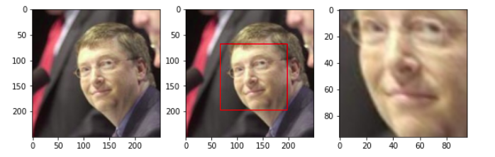
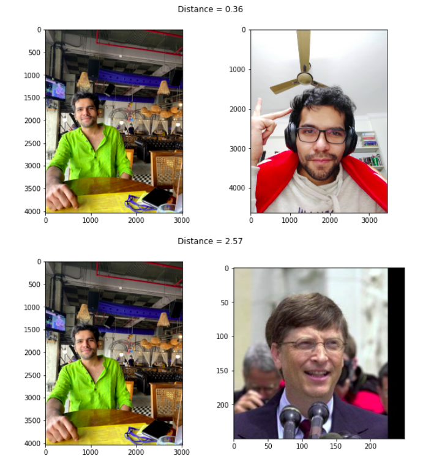
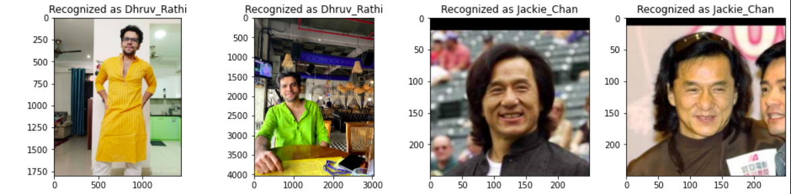

# Facenet paper implementation

* Implementation of the [Facenet paper](https://arxiv.org/abs/1503.03832), main focus was to try working with the very interesting (harmonic)Triplet Loss. 
* Facial Alignment as discussed in the paper is implemented - with the help of Dlib and OpenCV.
* Model as discussed is prepared and training is done on really small custom dataset.
* Weights from the pretrained OpenFace model(an implementation of FaceNet trained on the public datasets FaceScrub and CASIA-WebFace) are used further.
## Results -

* Alignment -

* Verification -

* Recognition -

